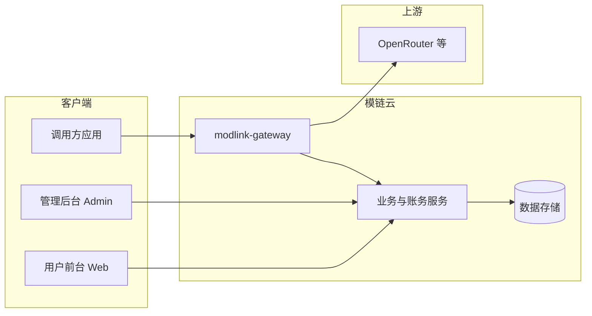

# 模链云（ModLinkCloud）产品需求文档（PRD）

| 属性 | 内容 |
|------|------|
| **文档版本** | v0.5 |
| **状态** | 评审中（已定结论见 §17） |
| **更新日期** | 2026-05-10 |
| **范围** | 全产品（含网关、双端、计费、风控、报表、运维） |
| **关联文档** | [模链云-产品说明书](./模链云-产品说明书.md)、[用户协议要点](./模链云-用户协议要点.md)、[隐私政策要点](./模链云-隐私政策要点.md) |

---

## 修订记录

| 版本 | 日期 | 作者 | 变更说明 |
|------|------|------|----------|
| v0.1 | 2026-05-10 | — | 初稿：基于当前共识整理详细需求与待确认项 |
| v0.2 | 2026-05-10 | — | 与客户对齐 Q1–Q10：境内人民币与支付顺序、一期含企业与大屏、仅 OpenRouter、Base URL 示例、usage 策略说明、注册策略建议、不书面 SLA |
| v0.3 | 2026-05-10 | — | 采纳产品侧补充建议：Q4 分层策略与滥用加固、Q8 注册与充值门槛、**Q6 推荐独立 API 子域** |
| v0.4 | 2026-05-10 | — | 客户确认 **Q6**：一期固定采用 **独立 API 子域**（`https://api.<域名>/v1`） |
| v0.5 | 2026-05-10 | — | 共机部署：URL 增加统一前缀 **`/mlk`**（推理 `…/mlk/v1`，平台 `…/mlk/platform/v1`）；与 API 文档 **v1.4** 对齐 |

---

## 1. 背景与愿景

### 1.1 背景

企业与开发者需要统一使用多家大模型能力，但面临多渠道对接复杂、用量与成本难管控、运营侧缺少配置与审计工具等问题。**模链云**在统一账号与计费体系下，提供用户门户、管理后台与 **API 网关**，将下游调用路由至后台接入的第三方推理服务（首期以 **OpenRouter** 等聚合接入为主），并叠加计费、风控与数据报表能力。

### 1.2 产品愿景（一句话）

提供 **可运营、可治理、可观测** 的智能化 SaaS：**终端用户与开发者在本产品中完成账号、用量与集成**；AI 推理由后台授权上游交付；模链云聚焦 **体验、账务、合规与风控**，而非向终端用户裸售上游 API 目录。

### 1.3 设计原则

| 原则 | 说明 |
|------|------|
| **SaaS 优先** | 对外价值叙事为产品与服务体系；API 为集成手段之一。 |
| **网关薄、策略厚** | 转发路径尽量透明；鉴权、计费、风控、审计在平台侧闭环。 |
| **上游可替换** | 渠道与模型抽象，避免绑定单一供应商实现。 |
| **默认安全** | 密钥与敏感日志最小暴露；高风险操作可审计。 |

---

## 2. 目标与成功指标

### 2.1 业务目标

- 支撑 **商业化售卖**：充值、套餐、用量计费与对账可追溯。  
- 支撑 **规模化运营**：多渠道、多模型、策略可配置。  
- 降低 **滥用与资金风险**：限流、额度、黑白名单与异常监控。

### 2.2 成功指标（初稿，可替换）

以下指标需在 **一期上线前** 由产品与研发共同敲定基线与采集方式：

| 类别 | 示例指标（待定） |
|------|------------------|
| **可用性** | 网关核心路径月度可用性目标（如 99.5%+）、P95 延迟上限 |
| **转化** | 注册 → 首充 → 首次 API 成功调用漏斗 |
| **账务** | 扣费准确率、对账差异率、欠费拦截成功率 |
| **风控** | 异常调用识别命中率、误杀率上限 |

---

## 3. 范围定义

### 3.1 本期纳入范围（In Scope）

- 管理后台：用户与权限、上游渠道、模型与路由、订单与充值、系统配置。  
- 用户前台：账号体系、**企业租户与成员（一期即交付）**、API Key、充值与余额/额度、用量与账单查询、调用文档。  
- **modlink-gateway**：与 OpenAI/OpenRouter 兼容的 Chat Completions 类路径、流式/非流式、路由与参数透传、与计费/风控/日志联动。  
- 计费：规则配置、实时扣减、账单明细。  
- 风控：限流、额度、黑白名单、调用频率监控。  
- 报表：多维用量统计、管理看板、**数据大屏（一期即交付）**、调用与审计日志查询。  
- 安全运维：基线安全能力、监控告警、运维所需配置与发布协作（边界见下）。

### 3.2 明确暂不纳入或弱化（Out of Scope / 后续）

以下内容默认为后续迭代（若纳入需单独变更 PRD）：

- 自建或微调自有模型训练平台。  
- 与 OpenRouter **无关**的独家厂商直连的大量适配（首期仅 OpenRouter；抽象可预留）。  
- **展厅级**大屏动效、定制化实体大屏硬件交付（一期以 **管理侧数据大屏 / 全屏 KPI** 为主，不强制硬件）。  
- **Stripe 等境外支付**（已列为待办，见 §17）。  
- 移动端原生 App（默认 Web 为主）。

---

## 4. 角色与用户画像

### 4.1 角色定义

| 角色 | 描述 | 主要触点 |
|------|------|----------|
| **终端用户** | 使用模链云提供的对话/应用场景完成工作的个人或企业成员 | `modlink-cloud-web` |
| **开发者用户** | 在本平台创建 API Key，将自有系统对接到模链云网关 | `modlink-cloud-web` + 网关 HTTPS API |
| **运营/管理员** | 配置渠道、模型、用户与订单，查看报表与风控 | `modlink-cloud-admin` |
| **超级管理员** | 系统级配置、高危操作、审计（可与管理员合并或分级） | `modlink-cloud-admin` |
| **运维人员** | 部署、监控、告警响应、容量管理（多数能力可不暴露给租户） | 运维工具链 / 内部 |

### 4.2 典型场景（示例）

1. **开发者**：注册 → 实名/充值策略通过 → 创建 API Key → 按文档将 `base URL` 指向模链云网关 → 调用 `chat/completions`（流式或非流式）→ 在控制台查看用量与账单。  
2. **运营**：上架可用模型列表、配置上游 OpenRouter 渠道密钥与路由、配置计价与套餐、处理充值订单纠纷（流程待定）。  
3. **风控**：某 Key 突发高频调用 → 触发限流或熔断策略 → 告警通知运维/运营 → 黑白名单干预。

---

## 5. 系统上下文（逻辑）

说明：**网关**承担实时转发与策略 enforcement；**业务服务**承担账号、订单、计费配置、报表聚合等（物理部署可为同一进程或多服务，由架构设计确定）。

---

## 6. 仓库与交付形态

| 仓库 | 职责 | PRD 约束 |
|------|------|----------|
| **modlink-cloud** | 总仓：顶层文档、约定、编排、子模块引用或版本矩阵 | 发布清单与跨仓接口说明与此同步 |
| **modlink-gateway** | HTTP(S) 转发、鉴权、流式处理、与账务/风控交互 | 须满足第 7 章网关需求 |
| **modlink-cloud-admin** | 管理后台前端 | 须覆盖第 8 章功能 |
| **modlink-cloud-web** | 用户前台前端 | 须覆盖第 9 章功能 |

---

## 7. 网关与上游兼容性需求（核心）

### 7.1 协议与路径

| ID | 需求描述 | 优先级 |
|----|----------|--------|
| GW-001 | 对外提供与 **OpenAI Chat Completions 兼容** 的调用方式（路径、请求体字段语义与客户端常用参数），使现有 OpenAI SDK 可将 `baseURL` 指向模链云网关完成迁移 | P0 |
| GW-002 | 支持 **流式（SSE）** 与 **非流式** 响应 | P0 |
| GW-003 | 支持将请求 **路由** 至配置的上游渠道（首期至少支持 OpenRouter 兼容端点）；默认上游地址可配置 | P0 |
| GW-004 | 在策略允许范围内 **透传** 客户端请求体与必要头；对非法或违禁参数 **拦截或改写**（规则可配置，最小实现可先做黑名单字段） | P0 |
| GW-005 | 使用平台颁发的 **API Key**（或等价凭证）鉴权；禁止将上游渠道密钥下发给终端客户端 | P0 |
| GW-006 | 上游失败时返回 **稳定错误结构**（含可追踪 `request_id`），避免泄漏上游密钥 | P0 |

### 7.2 流式与计费协同

| ID | 需求描述 | 优先级 |
|----|----------|--------|
| GW-010 | 流式 / 非流式结束时尽可能解析 **最终 usage（token）**；若上游未返回 usage，按 **§17.2 已定策略**（估算扣费 + 标记待对账 + 管理后台可调）执行 | P0 |
| GW-011 | 客户端断开连接时，行为需定义（取消上游 / 继续扣费至结束——待定） | P1 |

### 7.3 可观测性

| ID | 需求描述 | 优先级 |
|----|----------|--------|
| GW-020 | 每次调用生成唯一 **request_id**，贯穿日志与账单明细 | P0 |
| GW-021 | 记录_latency、HTTP 状态、模型名、用户/Key 维度标识（不落密钥明文） | P0 |

---

## 8. 管理后台功能需求（modlink-cloud-admin）

### 8.1 用户与权限

| ID | 需求描述 | 优先级 |
|----|----------|--------|
| ADM-001 | 用户列表：搜索、状态（启用/禁用）、创建时间、**所属企业租户/组织** | P0 |
| ADM-002 | 支持 **角色与权限**：至少区分运营、财务查看、超级管理员（细粒度矩阵可迭代） | P1 |
| ADM-003 | 支持对用户执行 **禁用**、**重置策略关联** 等运维动作并写审计日志 | P0 |
| ADM-010 | **企业/租户**列表：名称、所有者、成员数、状态；支持运营侧查看与禁用（高危审计） | P0 |
| ADM-011 | 租户成员查询；必要时 **重置租户管理员**（高危 + 审计） | P1 |

### 8.2 上游渠道管理

| ID | 需求描述 | 优先级 |
|----|----------|--------|
| CH-001 | 渠道列表：名称、类型（OpenRouter 等）、Base URL、健康状态（可选）、绑定密钥（脱敏展示） | P0 |
| CH-002 | 支持 **主备或多渠道优先级**（首期可只做单渠道 + 手工切换） | P1 |
| CH-003 | 渠道级 **熔断/降级** 开关（与监控联动） | P2 |

### 8.3 模型管理

| ID | 需求描述 | 优先级 |
|----|----------|--------|
| MDL-001 | 平台 **可用模型列表**：对用户可见名称、`provider/model` 标识、是否启用、默认计价关联 | P0 |
| MDL-002 | 支持从上游 **同步或导入** 模型目录（手动导入 CSV/JSON 可作为 MVP） | P1 |
| MDL-003 | 模型级 **覆盖参数**（如最大上下文提示，用于校验） | P2 |

### 8.4 路由策略

| ID | 需求描述 | 优先级 |
|----|----------|--------|
| RT-001 | 定义「客户端指定模型」到「实际上游模型 ID」的映射（默认可 1:1） | P0 |
| RT-002 | 支持按 **用户 / 企业租户 / 套餐** 限制 **可用模型集合** | P0 |

### 8.5 订单与充值管理

| ID | 需求描述 | 优先级 |
|----|----------|--------|
| ORD-001 | 订单列表：用户、金额、渠道、状态、创建时间 | P0 |
| ORD-002 | 支持 **手工补单/调账**（权限受限 + 审计） | P1 |
| ORD-003 | 导出对账报表（CSV，字段待定） | P1 |

### 8.6 系统配置

| ID | 需求描述 | 优先级 |
|----|----------|--------|
| CFG-001 | 全局开关：注册开关、维护模式、默认计价模板 | P0 |
| CFG-002 | 安全策略：密码强度、登录失败锁定、可选 MFA（可分期） | P1 |
| CFG-003 | **对外网关正式域名 / Base URL 前缀**（与 **§17.3** 一致：独立 `api` 子域 + 路径 **`/mlk/v1`**；平台 **`/mlk/platform/v1`**），供控制台复制、文档模板与探活展示 | P0 |

---

## 9. 用户前台功能需求（modlink-cloud-web）

### 9.1 账号体系

| ID | 需求描述 | 优先级 |
|----|----------|--------|
| WEB-001 | 注册 / 登录 / 找回密码；会话管理与登出；**注册策略**见 §17.1 | P0 |
| WEB-002 | 用户资料：邮箱/手机（按需）、昵称；**实名/KYC** 是否强制——待定 | P1 |
| WEB-010 | **企业租户**：创建/切换当前组织、**邀请成员**、组织内角色（如所有者/管理员/成员）、组织级 **API Key 与余额归属**（扣费归集到组织或按产品规则，详设中定） | P0 |

### 9.2 API 密钥管理

| ID | 需求描述 | 优先级 |
|----|----------|--------|
| KEY-001 | 创建 / 禁用 / 删除 Key；**仅创建时完整展示一次**；Key 可归属 **个人或企业租户**（与 WEB-010 一致） | P0 |
| KEY-002 | Key 粒度 **可选绑定**：备注、过期时间（可选）、IP 白名单（可选，分期） | P1 |

### 9.3 充值与余额

| ID | 需求描述 | 优先级 |
|----|----------|--------|
| PAY-001 | 展示当前 **余额或额度**（**人民币**，单位与命名产品化）；境内主体与开票规则见 §17.1 | P0 |
| PAY-002 | 发起充值订单：**首期微信支付 → 支付宝**；**Stripe 境外支付列入待办**，不与首期同级交付 | P0 |
| PAY-003 | 充值记录与状态查询 | P0 |

### 9.4 用量与账单

| ID | 需求描述 | 优先级 |
|----|----------|--------|
| USG-001 | 按日/月汇总：调用次数、输入/输出 token（以实际上游返回为准） | P0 |
| USG-002 | **账单明细**列表：时间、模型、费用、request_id 跳转日志 | P0 |

### 9.5 调用文档

| ID | 需求描述 | 优先级 |
|----|----------|--------|
| DOC-001 | 提供 **Base URL**（形态示例见 §17.3）、鉴权头格式、示例（cURL / Python / OpenAI SDK 指向网关） | P0 |
| DOC-002 | 说明流式与非流式、错误码、限额说明 | P0 |

---

## 10. 计费与财务需求

### 10.1 计价模型（逻辑）

| ID | 需求描述 | 优先级 |
|----|----------|--------|
| BIL-001 | 支持配置 **单价**：至少支持按 **输入 token / 输出 token** 计价（或与上游账单单位对齐） | P0 |
| BIL-002 | 支持 **套餐**：充值赠送、包月包量等——可做二期 | P1 |
| BIL-003 | 价格变更 **生效时间** 与历史版本可追溯（防止账单争议） | P1 |

### 10.2 扣费与时序

| ID | 需求描述 | 优先级 |
|----|----------|--------|
| BIL-010 | **实时扣减**：请求完成后根据 usage 扣费；余额不足时 **拒绝新请求**（策略可配置预警阈值） | P0 |
| BIL-011 | 支持 **最小计费单位**（如按次整数 token）— 规则待定 | P1 |
| BIL-012 | 账单 **可调账** 入口在管理后台，全程审计 | P1 |

---

## 11. 风控需求

| ID | 需求描述 | 优先级 |
|----|----------|--------|
| RSK-001 | **限流**：按 API Key、用户、全局维度配置 QPS/并发（分段实现：先做 Key 级） | P0 |
| RSK-002 | **额度**：日配额、月配额、总余额下限 | P0 |
| RSK-003 | **黑白名单**：IP、用户 ID、Key ID（分期可做 Key 级 IP） | P1 |
| RSK-004 | **频率监控**：异常突增告警（阈值配置 + 通知渠道待定） | P1 |

---

## 12. 数据统计与报表

| ID | 需求描述 | 优先级 |
|----|----------|--------|
| RPT-001 | 维度：**用户、API Key、模型、日**（小时级可做 P1） | P0 |
| RPT-002 | 管理看板：总调用量、Token、收入估算、错误率 | P0 |
| RPT-003 | **数据大屏**：全屏 KPI（调用量、Token、错误率、收入估算等）—— **一期交付** | P0 |
| RPT-004 | 日志检索：按 request_id、用户、**租户**、模型、状态码、时间段筛选 | P0 |
| RPT-005 | 日志内容策略：**默认不存储 Prompt/Completion 全文**，仅存元数据；支持用户 **显式开启调试留存**（你已认可）；合规见隐私政策 | P0 |

---

## 13. 安全与运维需求

### 13.1 安全

| ID | 需求描述 | 优先级 |
|----|----------|--------|
| SEC-001 | 全站 HTTPS；密钥与上游密钥 **加密存储** | P0 |
| SEC-002 | 管理后台 **独立鉴权** 与高权限操作 MFA（可分阶段） | P1 |
| SEC-003 | **审计日志**：管理员关键操作留痕 | P0 |

### 13.2 运维与监控

| ID | 需求描述 | 优先级 |
|----|----------|--------|
| OPS-001 | 网关 QPS、延迟、错误率、上游可用性指标 | P0 |
| OPS-002 | 告警：可用性跌破阈值、错误率飙升、上游连续失败 | P0 |
| OPS-003 | 健康检查接口（负载均衡探活） | P0 |

---

## 14. 非功能性需求（摘要）

| 类别 | 要求 |
|------|------|
| **性能** | 网关转发引入延迟相对直连上游增加可控（目标值待压测后写入，例如 P99 &lt; 50ms 量级为候选） |
| **扩展** | 网关无状态水平扩展；会话与限流依赖 Redis 等外部组件时可横向扩容 |
| **一致性** | 账务扣减须避免重复扣费（幂等与事务策略在详细设计中展开） |
| **兼容** | 客户端常用 OpenAI SDK 版本可不经修改仅换 baseURL（个别高级参数若上游不支持需在文档列出） |

---

## 15. 分期建议（缺省 roadmap，可按评审调整）

| 阶段 | 目标 |
|------|------|
| **MVP / 一期** | 用户注册登录（策略见 §17.1）、**个人 + 企业租户与成员**、Key（可归组织）、**仅上游 OpenRouter**、chat 流式/非流式、**人民币**计费与 **微信→支付宝** 充值、管理后台渠道与模型开关、报表 + **数据大屏**、日志 request_id；**不书面承诺 SLA**（§17.1） |
| **V1** | 多上游渠道路由（仍可与 OpenRouter 并存）、完善风控（黑白名单）、账单导出、告警增强 |
| **后续** | Stripe 等境外支付、套餐与复杂计价、MFA、展厅级动效等 |

---

## 16. 风险与依赖

| 风险 | 缓解 |
|------|------|
| 上游变更模型或定价 | 模型目录同步机制；公告与兼容窗口 |
| 上游不可用 | 健康检查、熔断、多渠道（ roadmap） |
| 流式 usage 缺失导致账务不准 | 预估策略 + 对账任务；详见 **§17.2** |
| 合规 | 隐私政策与用户协议定稿；Prompt 日志默认策略保守 |

---

## 17. 需求确认结论（v0.5）

以下为客户确认结论及 **产品侧采纳的补充默认**；与上文需求 ID 一致引用。

### 17.1 商业、支付、组织、注册、SLA

| # | 主题 | 已定结论 |
|---|------|----------|
| Q1 | 货币与区域 | **人民币**为主，**先考虑境内**（展示、支付、主体与开票按境内方案设计）。 |
| Q2 | 支付顺序 | **先做微信支付，再做支付宝**；**Stripe 列为待办**，不纳入一期同级交付。 |
| Q3 | 企业租户 | **一期即交付**「企业租户 + 成员」，不推迟到二期（详见 WEB-010、ADM-010）。 |
| Q6 | Base URL | **客户确认**：独立 **`api`** 子域；路径增加 **`/mlk`** 命名空间（与其它系统 **共机** 时分流）。控制台与文档默认：**推理** `https://api.<备案域名>/mlk/v1`，**平台** `https://api.<备案域名>/mlk/platform/v1`（OpenAI SDK `baseURL` = `…/mlk/v1`）。详见 **§17.3**。 |
| Q5 | Prompt 日志 | **采纳**：默认 **不存全文**，仅存元数据；提供用户 **显式开启调试** 以留存全文（配合隐私政策）。 |
| Q8 | 注册策略 | **采纳（v0.3 细化）**：**开放注册 + 风控兜底**（验证码、接口限频、异常 IP/设备拦截）；后台可切换 **邀请码 / 人工审核**（CFG）。**默认允许注册**，但 **API 调用与余额挂钩**：建议 **新用户默认余额为 0**（或极低试用额度，详设可选），**充值后再放开正常调用**，利用充值门槛抑制刷号。**企业高配额或开票前**可要求补 **邮箱域名或资质**（不阻塞个人开发者注册）。 |
| Q9 | 上游 | **首期仅接入 OpenRouter**；架构预留多渠道，不要求首期直连其他厂商。 |
| Q10 | SLA | **不对客户书面承诺数值 SLA**；可提供最佳努力说明与非担保 uptime；如需「状态页」另列运维交付项。 |

### 17.2 Q4：什么是「usage 缺失」，以及已定扣费策略（说明）

**场景**：客户端调用 Chat Completions（尤其 **SSE 流式**）后，理想情况是上游在响应尾部返回 **`usage`**（输入/输出 token 计数）。若网络中断、上游 bug、或个别路径未返回 **usage**，平台将无法按「真实 token」精确扣费。

**已定策略（v0.3，采纳产品侧建议）**：

1. **能用就用**：非流式与流式最后一帧中若有 **`usage`**，一律按 **真实 `usage`** 结算。  
2. **无 `usage` 时**：采用 **可解释、偏保守** 的估算（例如结合请求 messages 与已输出 completion 的长度，按字符/启发式 token 系数折算）；完成 **一次扣费**，账单行标记 **「估算 / 待对账」**，支持后台 **人工调账**（BIL-012）。**默认不以「直接拒绝请求」为主策略**（避免流式最后一包丢失导致大面积失败）。  
3. **异步校准**：有能力时与 OpenRouter / 平台侧 **对账单或用量明细** 做 **补差或冲正**，压低长期误差。  
4. **滥用加固（可选触发）**：对 **连续多次无 usage**、估算误差异常、或风控标记的 Key，可叠加 **临时限制**（如要求非流式、人工复核、冻结），**不对全体用户收紧默认策略**。

### 17.3 Q6：对外 Base URL 形态 — **已定：独立 API 子域**

**客户已确认采纳（v0.4）**：一期 **文档与控制台默认展示的 Base URL** 采用 **独立 API 子域**，且为 **与其它系统共机部署** 预留 **统一路径前缀 `/mlk`**：

- **推理网关**：`https://api.<备案域名>/mlk/v1`
- **平台 API**：`https://api.<备案域名>/mlk/platform/v1`

（示例：`https://api.modlinkcloud.cn/mlk/v1`，域名以实际为准。）

**推荐理由**：

| 维度 | 说明 |
|------|------|
| **安全与隔离** | API 与官网 **Cookie / 登录态** 分离，降低会话串扰与部分 Web 攻击面。 |
| **运维与网关** | 可对 `api.*` **单独**配置 TLS、超时、SSE、限流与扩容；与静态站点 **发布节奏解耦**。 |
| **CDN / WAF** | 对 API 路径禁用不当缓存、延长流式超时；官网仍可走 CDN 加速，互不拖累。 |
| **开发者习惯** | `api.` 子域为常见 API 入口，与 OpenAI SDK「换 baseURL」心智一致。 |

**备选**：主域路径前缀，如 `https://www.example.com/api/v1`。适用于强诉求「单一主域」的场景；需额外注意 **CDN 勿缓存 API**、Cookie 作用域、以及 SPA 与 API **同源策略 / 路由** 复杂度。**不作为一期默认文档形态**，若启用须在控制台同时标明。

**OpenAI SDK（伪代码）**：`baseURL = "https://api.<备案域名>/mlk/v1"`，`apiKey = <用户在控制台创建的 Key>`。

### 17.4 Q7：大屏

**一期交付**「数据大屏」（管理侧全屏 KPI），需求见 **RPT-003**；与 §3 范围一致。

---

## 18. 附录：需求追溯

本文档中带有前缀的需求 ID（如 `GW-001`、`ADM-001`）建议在研发任务与测试用例中引用，便于追溯。

---

**文档结束（v0.4）**
