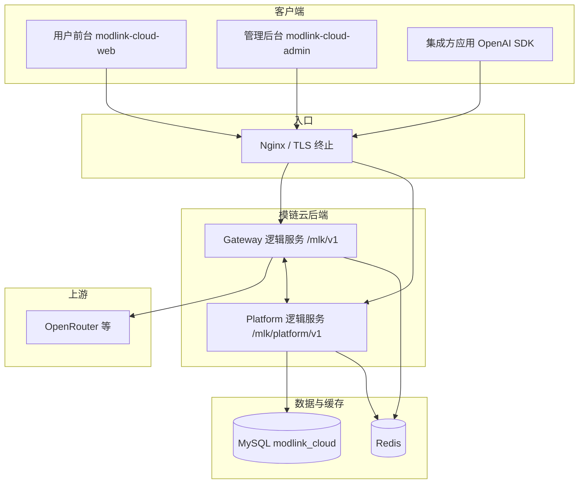

# 模链云（ModLinkCloud）总体技术设计方案

| 属性 | 内容 |
|------|------|
| **文档版本** | v1.1 |
| **更新日期** | 2026-05-10 |
| **状态** | 与 PRD **v0.5**、API **v1.5**、MySQL 设计 **v1.0**、服务划分 **v1.1** 对齐；实现前可做压测与幂等细节微调 |
| **关联文档** | [PRD](./模链云-产品需求文档-PRD.md)、[API 接口文档](./模链云-API接口文档.md)、[API 详述](./模链云-API接口文档-详述.md)、[MySQL 设计](./模链云-MySQL数据库设计.md)、[服务划分与仓库](./模链云-服务划分与仓库说明.md)、[前端技术选型](./模链云-前端技术选型说明.md)、[OpenAPI](./openapi/README.md) |

---

## 1. 文档目的与范围

本文在已有 **产品需求（PRD）**、**HTTP 接口契约**、**MySQL 表结构** 之上，给出 **端到端技术方案**：逻辑服务边界、关键链路、数据与一致性策略、安全与观测、部署形态及演进边界。  
**不包含**：具体类名/包结构（留在各仓库 README 与代码）、压测目标数值（上线前测定）、运维值班流程。

---

## 2. 设计原则（承接 PRD）

| 原则 | 技术落点 |
|------|----------|
| **网关薄、策略厚** | Gateway 专注兼容转发、鉴权头解析、流式透传、与账务/风控的 **原子协作点**；复杂规则在 Platform 配置、Gateway 执行 |
| **上游可替换** | `channels` + `model_routes` + `platform_models` 抽象渠道与模型名映射；业务代码不硬编码 OpenRouter 路径 |
| **默认安全** | API Key / 上游密钥 **仅存哈希或 KMS/加密字段**；推理日志 **默认不落 Prompt 全文**（见 PRD §17.1 Q5） |
| **账务可追溯** | `wallet_transactions`、`inference_logs`、订单与 **`request_id`** 贯穿；扣费 **幂等**、可调账有审计 |
| **共机可分流** | 统一前缀 **`/mlk`**，入口反向代理一次匹配即可落到模链云后端（见 [API §1](./模链云-API接口文档.md)） |

---

## 3. 系统上下文

**说明**：图中 **Gateway 与 Platform 为逻辑边界**；物理上可为 **两个进程** 或 **单进程挂载两套路由**（见 [服务划分 §3](./模链云-服务划分与仓库说明.md)）。**admin / web 仅调用 Platform**；**开发者集成仅调用 Gateway**。

---

## 4. 仓库与交付形态

| 仓库 | 职责 | 备注 |
|------|------|------|
| **modlink-cloud** | 文档、约定、编排、版本矩阵 | 可汇总各子仓库 |
| **modlink-gateway** | 后端：**Gateway + Platform** 代码同仓 | 推荐 `cmd/gateway` + `cmd/platform` 两个二进制，或单二进制注册 `/mlk/v1` 与 `/mlk/platform/v1` |
| **modlink-cloud-admin** | 管理后台 SPA | 仅请求 **`…/mlk/platform/v1`** |
| **modlink-cloud-web** | 用户门户 SPA | 仅请求 **`…/mlk/platform/v1`** |

---

## 5. 运行时架构：Gateway 与 Platform

### 5.1 URL 与职责（已定）

| 逻辑服务 | Base URL | 鉴权 | 主要职责 |
|----------|----------|------|----------|
| **Gateway** | `https://api.{域名}/mlk/v1` | `Authorization: Bearer mk_live_\|mk_test_…` | Chat Completions / Embeddings（若开启）、**SSE**、解析 **usage**、联动限额扣费、写 **`inference_logs`** |
| **Platform** | `https://api.{域名}/mlk/platform/v1` | JWT（用户/管理员） | 注册登录、租户与成员、API Key 签发、钱包与订单、支付回调、渠道与模型与计价配置、报表与管理接口 |

### 5.2 Gateway 内部模块（概念）

1. **认证模块**：校验平台 API Key（查库或缓存校验哈希）、解析 Key 归属 **用户或组织**、解析 **`X-Org-Id` 与 JWT 无关（此处仅 Key 维度）** — 与 API 文档「组织上下文」一致时，以 Key 绑定 org + 可选 Header 为准。  
2. **路由模块**：客户端 `model` → `model_routes` → 渠道 `channels`、上游 model id。  
3. **策略前置**：限流 / 黑名单 / 余额是否充足（**读**钱包或调用 Platform 内部 API）。  
4. **转发模块**：HTTP/SSE 透传；上游 **`Authorization` 注入渠道密钥**（终端不可见）。  
5. **收尾模块**：解析 usage 或触发 **估算策略**（PRD §17.2）；**扣费 + 流水幂等**；异步写日志。

### 5.3 Platform 内部模块（概念）

账号与令牌、组织与邀请、API Key 生命周期、钱包与充值订单、**定价与套餐**（若一期简化则仅单价）、风控规则配置、管理端 CRUD、报表聚合查询、`admin_audit_logs`。

### 5.4 Gateway ↔ Platform 协作方式（需在实现阶段二选一或混合）

| 方案 | 适用 | 说明 |
|------|------|------|
| **同步 HTTP（内网）** | Gateway 扣费前校验余额、扣费请求 | 清晰分层；注意超时与熔断 |
| **共享库 + 直连 DB** | 同一进程内减少 RTT | **须谨慎**：事务边界仅限单体部署；拆进程时要收口为 HTTP/gRPC |
| **消息队列（后续）** | 异步对账、报表 | 一期非必须 |

**已定原则**：账务 **强一致** 落在 **单库事务 + `wallet_transactions` 幂等键**（与 API 文档「账务」摘要一致）；Gateway 侧扣费是否与 Platform 共用同一事务，取决于是否同进程 — **跨进程必须用显式接口 + 幂等 ID**。

---

## 6. 核心链路

### 6.1 推理（Chat / Embeddings）

1. 客户端请求 Gateway，`Authorization: Bearer <平台 API Key>`。  
2. 校验 Key → 解析主体（用户 / 组织）、环境（live/test）、可选 IP 策略（分期）。  
3. **风控**：限流、黑白名单；**余额**：可用额度不足则 **拒绝**（稳定错误码 + `request_id`）。  
4. 解析模型路由 → 组装上游请求（注入渠道 Key、可按配置改写 Referer/Title）。  
5. 非流式：等待完整响应 → 解析 `usage` → 计价扣费 → 写 `inference_logs`。  
6. 流式 SSE：边转发边缓冲 completion → 结束帧或连接关闭时结算 usage / 估算 → 扣费 → 写日志；PRD §17.2 **无 usage** 时估算并标记 **待对账**。  
7. **客户端断开**：已定尽力 cancel 上游并按已产生 usage/估算扣费（见 API 文档 **A–H**）。

### 6.2 控制台与管理端会话

1. 浏览器登录 Platform → JWT（含 `current_org_id`、role）。  
2. 后续请求 **`Authorization: Bearer <access_token>`**，可选 **`X-Org-Id`** 切换组织上下文（成员权限校验）。  
3. 管理端高危操作 **二次验证**（已定方向，实现可分阶段）。

### 6.3 充值与支付回调

1. 用户创建充值订单 → 调起微信/支付宝 → **回调入口在 Platform**（验签、**幂等**、更新 `orders`、入账 `wallet_transactions`）。  
2. 回调 **非 JSON 包裹** 的情况已在接口文档说明 — 实现按渠道原始 body 处理。

---

## 7. 数据架构

### 7.1 MySQL（权威定义见数据库设计文档）

逻辑模块与表对应关系可直接沿用 [模链云-MySQL数据库设计 §3](./模链云-MySQL数据库设计.md) **表清单**：账号、租户、密钥、钱包与流水、订单、渠道与模型与路由与计价、推理日志、风控规则、审计与系统配置等。

### 7.2 访问边界建议

| 数据 | 主要写入方 | 说明 |
|------|------------|------|
| `api_keys` | Platform | 哈希存储；Gateway **只校验** |
| `wallet_accounts` / `wallet_transactions` | Platform 订单入账；**推理扣费**建议与 Gateway 同一事务边界或通过 **幂等扣费接口** | 避免重复扣费 |
| `inference_logs` | Gateway（或异步消费者） | 元数据为主；含 `request_id`、模型、token、费用、是否估算 |
| `channels` / `model_routes` / `pricing_models` | Platform（管理端） | Gateway **读**，可缓存 |

### 7.3 Redis（建议用途）

- API Key 校验结果短期缓存（**失效策略**需与 Key 旋转一致）。  
- 限流计数（Key / 用户 / 全局限流）。  
- 幂等键：`request_id` 扣费、支付回调 `out_trade_no` 等。  
- 分布式锁（调账、订单关闭等临界区，按需）。

---

## 8. 计费与对账（摘要）

- **计价**：`pricing_models` 与模型 ID 关联；价格变更保留生效时间与历史（PRD BIL-003，可分阶段）。  
- **真实 usage 优先**；缺失则 **估算** + 标记；后续 **异步校准 / 人工调账**（PRD §17.2、BIL-012）。  
- **最小计费单位、套餐包月包量** 可作二期增强（PRD §15）。

---

## 9. 风控与安全

- **限流 / 配额 / 黑白名单**：配置在 Platform， enforcement 在 Gateway（读 Redis + 规则缓存）。  
- **密钥**：终端 **永不接触** OpenRouter Key；平台 API Key 仅 **`mk_live_` / `mk_test_` 前缀** 明文一次展示。  
- **审计**：`admin_audit_logs` 覆盖禁用用户、调账、渠道变更等高危操作。  
- **传输**：生产 **HTTPS**；错误响应 **不泄漏上游密钥**（PRD GW-006）。

---

## 10. 可观测性

- 每次请求 **`request_id`**：网关生成或承接，写入响应与日志（与 API **§2.3** 一致）。  
- **指标**：Gateway QPS、延迟、429/5xx、上游可用性；Platform 订单成功率、回调延迟。  
- **日志**：结构化 JSON；**Prompt 默认不落库**，调试开关打开时可按合规留存（隐私政策配套）。

---

## 11. 前端技术架构（摘要）

- **Vue 3 + Vite + TypeScript + Element Plus**，**admin** 与 **web** 两个独立工程（详见 [前端技术选型](./模链云-前端技术选型说明.md)）。  
- **统一 axios/fetch 封装**：Base URL 指向 **`/mlk/platform/v1`**；**从不直连 Gateway**。  
- **大屏**：管理侧全屏 KPI（PRD RPT-003），数据源为 Platform 报表接口。

---

## 12. 部署与接入层

- **DNS**：独立 **`api.` 子域**（PRD §17.3）。  
- **Nginx**：`location ^~ /mlk/` 反代至后端；WebSocket/SSE **超时与缓冲** 单独调优。  
- **与其它服务共用服务器（已定端口段）**：对外 HTTP **从 8100 起**：默认 **`8100`** 为模链云入口（Compose 中 Nginx 映射）；**8101 / 8102** 预留扩展；容器内 Gateway/Platform 仍 **:8080 / :8081** 仅 Docker 网络可见，避免与宿主机其它进程端口冲突。整机已有 Nginx 时可用 **`include`**（见 `deploy/nginx/host-mlk-proxy.conf`）把 **`^~ /mlk`** 转到 **`127.0.0.1:8100`**，与其它业务的 `location` 互不重叠。  
- **静态站点**：admin/web 可部署至 OSS + CDN；**API 路径禁用不当缓存**。  
- **健康检查**：供 LB 探活（接口路径以 OpenAPI/实现为准）。

---

## 13. 文档与契约分层

| 层级 | 文档 | 用途 |
|------|------|------|
| **人类可读全量** | [模链云-API接口文档.md](./模链云-API接口文档.md) | 背景约定、错误码、附录 A |
| **人类可读详述** | [模链云-API接口文档-详述.md](./模链云-API接口文档-详述.md) | 参数表 + HTTP 示例 |
| **机器可读** | [openapi/](./openapi/README.md) | SDK、Mock、契约测试 |
| **持久化** | [模链云-MySQL数据库设计.md](./模链云-MySQL数据库设计.md) | DDL 与字段含义 |

实现以 **OpenAPI + DDL** 为验收基准；PRD 需求 ID 用于追溯测试用例。

---

## 14. 演进与边界（非一期强制）

- **支付**：Stripe 境外支付列入待办（PRD Q2）。  
- **多上游**：渠道优先级、熔断、自动切换（PRD CH-002/003）。  
- **拆库拆服务**：网关无状态横向扩展；账务跨服务时需 **Saga / 可靠消息** 重新论证。  
- **前端**：未来若需小程序，可独立 uni-app 工程，仍只调 Platform API。

---

## 15. 修订记录

| 版本 | 日期 | 说明 |
|------|------|------|
| v1.0 | 2026-05-10 | 初稿：总体技术方案，与 PRD/API/DB/服务划分对齐 |
| v1.1 | 2026-05-10 | §12：共机端口约定 **8100 起**、与整机 Nginx include 策略 |

---

**文档结束**
